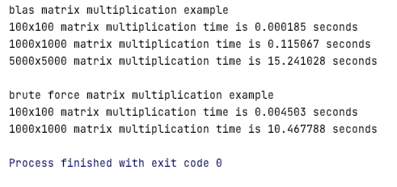

# scientific-computing-2021
This code shows performance difference between brute force matrix
manipulation and blas library api. Tests for 5000x5000 are commented out because
it works too long on my pc, but for 1000x1000 the difference is significant.

Tested on macbook pro i7

### Results

